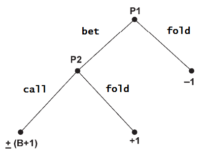
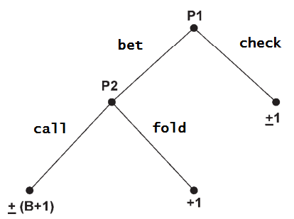

# Simplified Poker Saddle-Point Finder

A program written in Javascript used to find the saddle points of a simplified poker game.

## Simplfied Poker Game Explained

Note, there are two pages here, one for each version of a Simplfied Poker Game:

* Borel's Simplified Poker Game (1938)
* Von Neumann's Simplified Poker Game (1947)

Note: There have been many variations of a Simplified Poker game. However, we simply focus on these two simplest
forms.

### Common Rules for a Simplified Poker Game

Among the two games, there are some common rules:

* There are 2 players (denoted P1 and P2)
* Players are given a number `[0,1] ∈ R` which is referred to as "their hand"
* P1 plays first, where they can perform one of two actions
* P2 plays second, where they can respond with one of two actions
* The ante is `A=1` unit and the bet is `B` units
* If one player folds the other receives the ante from the other
* If both players have bet/called, the highest valued hand wins the `A + B` from the opposing player

In practise, we're more interested in a scenario where cards are given, instead of a random number. Therefore:

* Players are given a number `x ∈ [1, 2, ..., n]` which is referred to as "their hand"

### Borel's Simplified Poker Game (1938)

This version of the game has the player options listed below:

* P1's options are bet or fold
* P2's options are call or fold

The game tree for this game can be seen below:

### Von Neumann's Simplified Poker Game (1947)

This version of the game has the player options listed below:

* P1's options are bet or check
* P2's options are call or fold

The game tree for this game can be seen below:

## How to Use the Solver

To view the solver for a Borel game, open [borelish-ui.html](borelish-ui.html) (not sure if working).
To view the solver for a von Neumann game, open [psp-ui.html](psp-ui.html).
Example values for a game are `Ante` = 1, `Bet` = 2, and `# of Cards` = 7. The results will display as a list
of 0s and 1s, where a 0 indicates to check/fold if given the card, and a 1 indicates to bet/call given that card.

## Relevant Readings

* [Bluffing and Betting Behavior in a Simplified Poker Game, Darryl A. Seale* and Steven E. Phelan](https://drive.google.com/file/d/0B305za0bQ_wWcF9qTWRsa2ppS0E/view?usp=sharing&resourcekey=0-tVM4i_DOkr6ZCIQJ88PeZQ)
